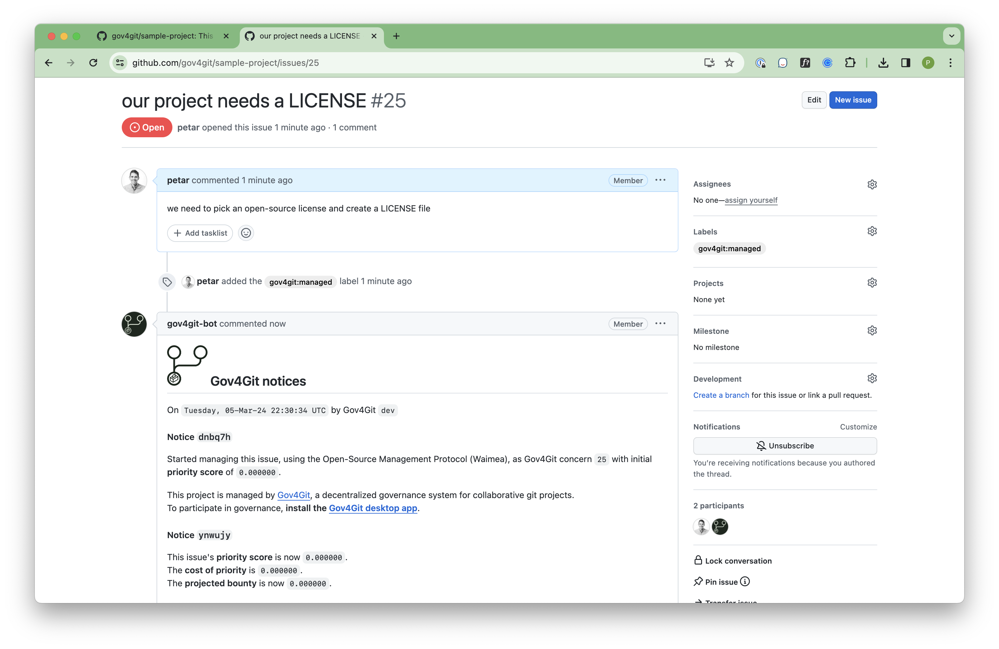
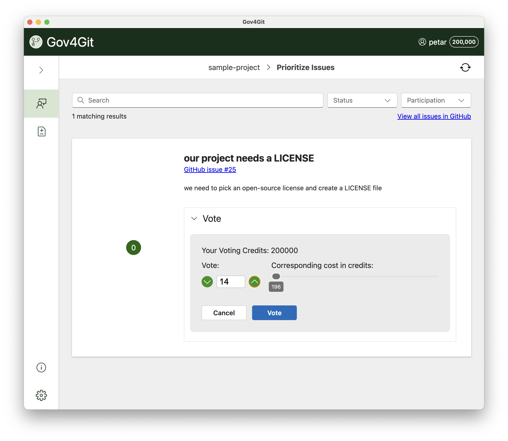

## Project Name

Gov4Git

## Category 

- developer tooling
- community management

## Project Description

Gov4Git is an independent, decentralized protocol for managing open source collaboration. It addresses a slew of common frictions and inefficiencies in collaborative open-source projects, by enabling communities to:

- __prioritize issues__ in a transparent and fair community-driven manner,
- __relieve maintainers__ from being a bottleneck in triage,
- objectively __quantify individual contributions__ based on peer review mechanisms, and
- conduct __decision-making__ on contentious issues in an efficient, inclusive, open, and democratic way.

Gov4Git is an independent system that can be deployed on any git provider.
It is also deeply integrated with GitHub, and provides a seamless user experience — suitable for non-technical users — via a desktop app.

## Project Status

Launched first release publically. Deployed by a few trial users.

## Previews

## Target Audience

Gov4Git is aimed at:
- community managers
- maintainers and contributors of open-source projects
- managers of decentralized teams

## Rough estimated user base (if applicable)

- 4 deployments
- 100 end users

## Github repo

- https://github.com/gov4git/gov4git

## Website

- https://gov4git.org

## Docs

- [Overview of Gov4Git and how it integrates into a GitHub project](https://www.gov4git.org/s/DEPLOY-MANAGE-COLLABORATE-OVERVIEW.pdf)
- [Step-by-step user's guide](https://github.com/gov4git/gov4git/blob/v2/doc/DEPLOY-MANAGE-COLLABORATE-DETAILED.pdf)
- [Detailed explanation of our governance mechanism for open-source communities](https://medium.com/@gov4git/waimea-collective-management-and-compensation-for-open-source-communities-affa9b9093e9)

## Team Info

Gov4Git is developed by the Gov4Git Foundation. Our team includes members of the Gov4Git Foundation, collaborators from partner organizations, as well as independent volunteers.

### Team Size  

14

### Team members  

- [Petar Maymounkov](https://x.com/maymounkov), Founder, Gov4Git Foundation
- Kasia Sitkiewicz, Business Development, GitHub
- Derek Worthen, UI Engineering, Microsoft Research
- Glen Weyl, Partner, Research, Microsoft Research
- Shivani Thakur, Volunteer, UX Design, independent contributor
- Theresa Merchant, Volunteer, UX Design, independent contributor
- Jason Entenmann, Partner, Management, Microsoft Research
- Shrey Jain, Partner, Research, Microsoft Research
- Tobin South, Partner, Research, MIT
- Abigail Cabunoc Mayes, Volunteer, Business and Community Relations, GitHub
- Nathan Evans, Partner, Management, Microsoft Research
- Aaron Wolf, Volunteer, Customer Research, independent contributor
- Tyler Flajole, Volunteer, Community Outreach and Sales, GitHub
- Julia Metcalf, Volunteer, Advisor, Funding, independent

## How the community can engage

- GitHub Discussion: https://github.com/filecoin-project/community/discussions/687
- Email:petar@gov4git.org
- Twitter: [@gov4git](https://x.com/gov4git)
- Discord: https://discord.gg/aheKQude

## How to Contribute

Please, start by [creating an issue in our repo](https://github.com/gov4git/gov4git/issues).
