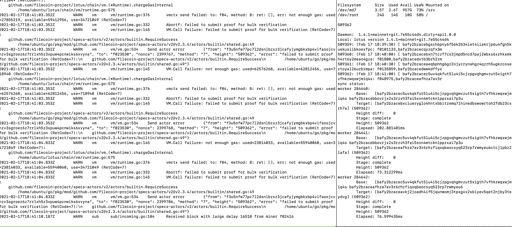

## Project Name: lotus
lotus

## Category 
<!--developer tooling, application, wallet, infrastructure, etc-->
Implementation

## Project Description
<!--Describe your project in a few sentences. -->
lotus is an implementation of the Filecoin Distributed Storage Network.

## Project Status
<!--brainstorming, fundraising, under development, beta, shipped, etc-->
Compatiable with Filecoin Mainnet.

## Previews
<!--Add some screenshots to give a preview of your product-->

## Target Audience
<!--Describe who will be your project's users-->
All users of the Filecoin network, including miners, clients, node operators, app developers and so on.

## Github repo
<!--Attach a link to your GitHub repo if it's OSS-->
https://github.com/filecoin-project/lotus

## Website
https://github.com/filecoin-project/lotus
<!--Link your website if available-->

## Docs
<!--Including a link to your project docs!-->
Build lotus: https://docs.filecoin.io/build/lotus/  
Run lotus miner: https://docs.filecoin.io/mine/lotus/  
Run lotus client: https://docs.filecoin.io/store/lotus/  

## Team Info
<!-- Introduce your amazing team - how many team members are working on this project and who are they?-->
lotus is a universally open-sourced project and has a lot of open source contributers. Currently, the maintainers are devs from [Protocol Labs.](https://protocol.ai)

### Team Size  
19

### Team members  
[Lotus team](https://github.com/orgs/filecoin-project/teams/lotus/members)

## How the community can engage
⭐️lotus Discussion: https://github.com/filecoin-project/lotus/discussions  
⭐️lotus Issue: https://github.com/filecoin-project/lotus/issues  
🗣Community Slack Channel: [filecoin/#fil-lotus](https://filecoinproject.slack.com/archives/CPFTWMY7N)  
📣Announcements: https://github.com/filecoin-project/community/discussions/62
🗞Newletter: https://github.com/filecoin-project/community/discussions/71

## How to Contribute
<!--How can the community contribute to your project?-->
[To all open source contributors - Welcome to Lotus!](https://github.com/filecoin-project/lotus/discussions/5518) 